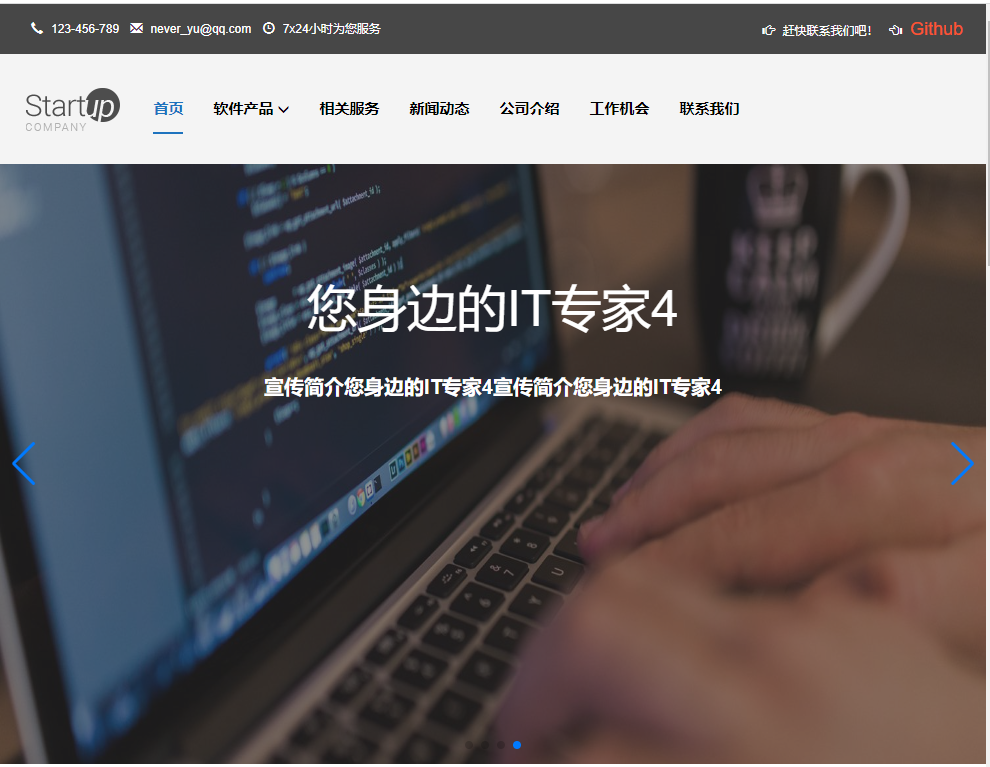
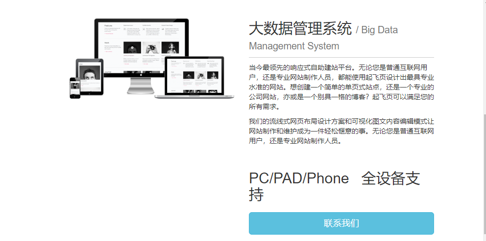
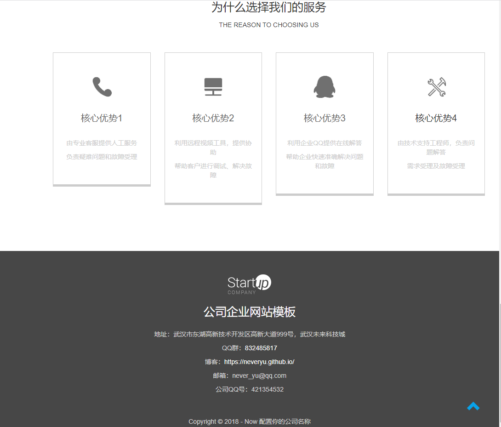

# Official-website

> 响应式的企业官方网站模板，使用 [Vite](https://cn.vitejs.dev/) 脚手架搭建，使用 [Vue3](https://cn.vuejs.org/) 开发。

## 运行/启动

```bash
npm i

npm run dev
```

## 构建&预览
```bash
# 构建生产环境
npm run build

# 预览构建的产品
npm run preview
```

## Vue 3 + Vite

This template should help get you started developing with Vue 3 in Vite. The template uses Vue 3 `<script setup>` SFCs, check out the [script setup docs](https://v3.vuejs.org/api/sfc-script-setup.html#sfc-script-setup) to learn more.

## Recommended IDE Setup

- [VS Code](https://code.visualstudio.com/) + [Volar](https://marketplace.visualstudio.com/items?itemName=Vue.volar)


## 技术要点

```bash
# bootstarp——整体框架，主要用到了栅格系统和一些组件

# swiper——轮播插件

# wow.js+animate.css——网站的整体动画插件

# axios——ajax请求

# vue-router——路由

# vuex——状态管理（项目没有用到）

# session storage——本地存储

# 对可复用的组件进行了封装，对api接口进行了封装
```

## About

- [我的个人博客](https://blog.csdn.net/csdn_yudong)
- [我的推荐阅读文章](https://neveryu.blog.csdn.net/article/details/124124137)


## 内容



